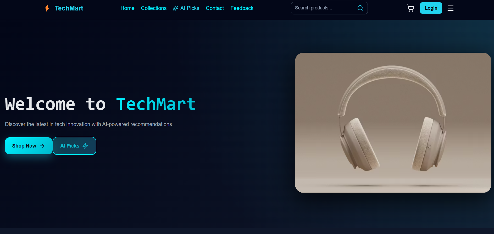
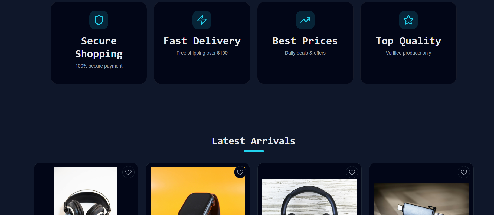
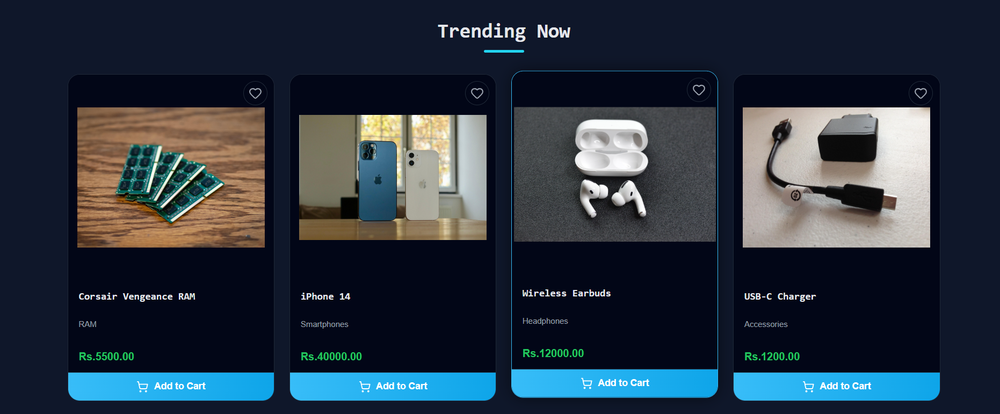
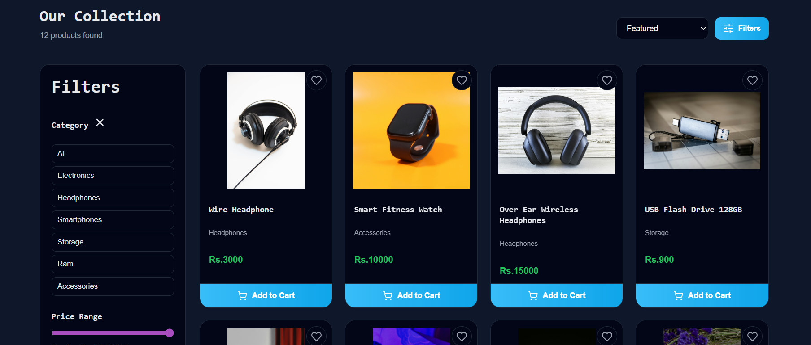
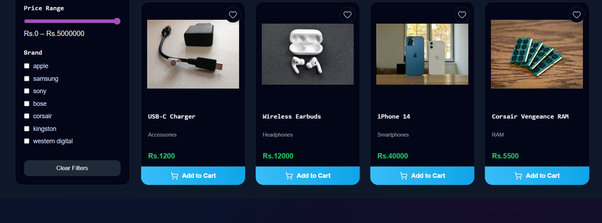
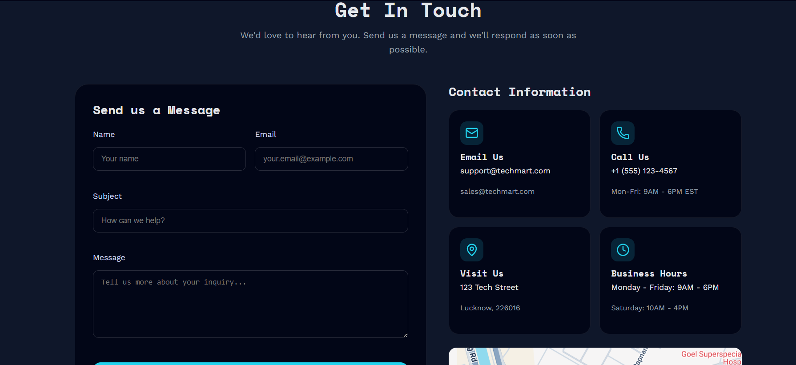
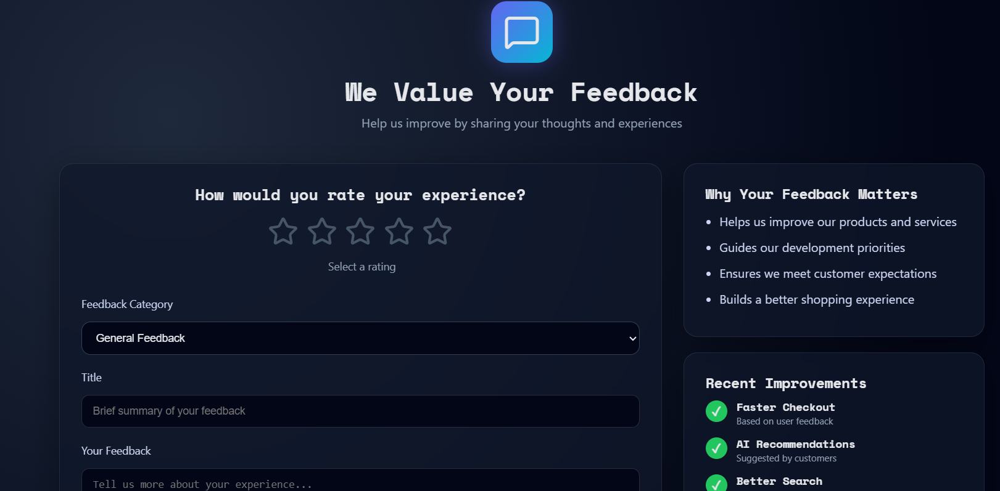
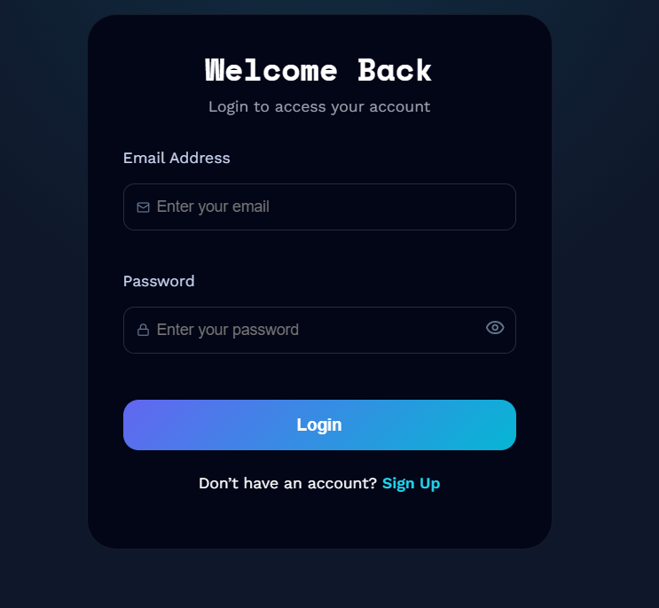
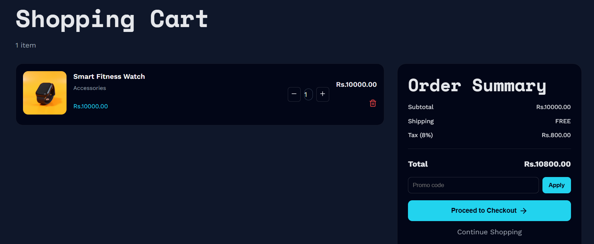
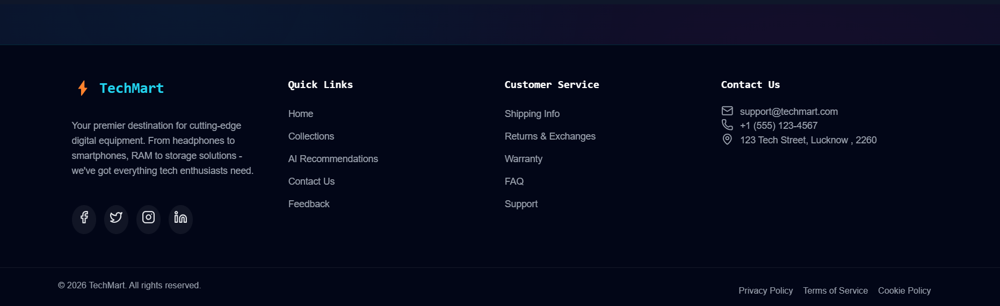

# E-Commerce TechMart

Complete Django REST API for E-Commerce platform with MySQL database.

## 🚀 Features

### Authentication & Users
- JWT-based authentication
- User registration and login
- Profile management
- Address management
- Admin user management

### Products
- Product CRUD operations
- Categories and Brands
- Product images and specifications
- Search and filtering
- Trending/Latest/Bestsellers endpoints
### AI
- AI-based product recommendation

### Orders
- Order creation and management
- Order status tracking
- Order history
- Admin order management

### Shopping Cart
- Add/Update/Remove items
- Cart persistence
- Stock validation

### Reviews
- Product reviews and ratings
- Verified purchase reviews
- Review approval system

## 📋 Requirements

- Python 3.10+
- MySQL 8.0+
- pip (Python package manager)

---

## Tech Stack

Frontend:
- HTML
- CSS
- JavaScript
- React

Backend:
- Django
- Django REST Framework

Database:
- PostgreSQL / SQLite

AI / ML:
- Recommendation Engine
- Product similarity algorithm

---

## 🛠️ Installation

### 1. Clone & Setup

```bash
# Navigate to backend directory
cd techmart-backend

# Create virtual environment
python -m venv venv

# Activate virtual environment
# On Windows:
venv\Scripts\activate
# On macOS/Linux:
source venv/bin/activate

# Install dependencies
pip install -r requirements.txt
```

### 2. Database Setup

```bash
# Login to MySQL
mysql -u root -p

# Create database
CREATE DATABASE techmart_db CHARACTER SET utf8mb4 COLLATE utf8mb4_unicode_ci;

# Create user (optional)
CREATE USER 'ecommerce_user'@'localhost' IDENTIFIED BY 'your_password';
GRANT ALL PRIVILEGES ON techmart_db.* TO 'ecommerce_user'@'localhost';
FLUSH PRIVILEGES;

# Exit MySQL
exit;
```

### 3. Environment Configuration

```bash
# Copy environment file
cp .env.example .env

# Edit .env file with your settings
nano .env  # or use any text editor
```

Required `.env` settings:
```
SECRET_KEY=your-django-secret-key-here
DEBUG=True
DB_NAME=techmart_db
DB_USER=root
DB_PASSWORD=your_mysql_password
DB_HOST=localhost
DB_PORT=3306
```

### 4. Run Migrations

```bash
# Create migrations
python manage.py makemigrations

# Apply migrations
python manage.py migrate
```

### 5. Create Superuser

```bash
python manage.py createsuperuser
```

### 6. Run Development Server

```bash
python manage.py runserver
```

The API will be available at `http://localhost:8000`

## 📚 API Documentation

### Swagger UI
Visit `http://localhost:8000/swagger/` for interactive API documentation

### ReDoc
Visit `http://localhost:8000/redoc/` for alternative documentation

## 🔑 API Endpoints

### Authentication
```
POST /api/auth/register/          - User registration
POST /api/auth/login/             - User login
POST /api/auth/token/refresh/     - Refresh JWT token
GET  /api/auth/profile/           - Get user profile
PUT  /api/auth/profile/           - Update profile
POST /api/auth/change-password/   - Change password
```

### Products
```
GET    /api/products/              - List products
POST   /api/products/              - Create product (Admin)
GET    /api/products/{slug}/       - Product detail
PUT    /api/products/{slug}/       - Update product (Admin)
DELETE /api/products/{slug}/       - Delete product (Admin)
GET    /api/products/trending/     - Trending products
GET    /api/products/latest/       - Latest products
GET    /api/products/bestsellers/  - Best sellers
```

### Orders
```
GET    /api/orders/                - List user orders
POST   /api/orders/                - Create order
GET    /api/orders/{id}/           - Order detail
PATCH  /api/orders/{id}/update_status/ - Update status (Admin)
GET    /api/orders/stats/          - Order statistics (Admin)
```

### Cart
```
GET    /api/cart/                  - Get cart
POST   /api/cart/add/              - Add item
PATCH  /api/cart/update/           - Update item
DELETE /api/cart/remove/           - Remove item
DELETE /api/cart/clear/            - Clear cart
```

### Reviews
```
GET    /api/reviews/               - List reviews
POST   /api/reviews/               - Create review
GET    /api/reviews/{id}/          - Review detail
PUT    /api/reviews/{id}/          - Update review
DELETE /api/reviews/{id}/          - Delete review
```

## 🔐 Authentication

The API uses JWT (JSON Web Tokens) for authentication.

### Login Example
```bash
curl -X POST http://localhost:8000/api/auth/login/ \
  -H "Content-Type: application/json" \
  -d '{
    "email": "user@example.com",
    "password": "password123"
  }'
```

Response:
```json
{
  "user": {
    "id": 1,
    "email": "user@example.com",
    "first_name": "John",
    "last_name": "Doe"
  },
  "tokens": {
    "access": "eyJ0eXAiOiJKV1QiLCJhbGc...",
    "refresh": "eyJ0eXAiOiJKV1QiLCJhbGc..."
  }
}
```

### Using Token
```bash
curl -X GET http://localhost:8000/api/products/ \
  -H "Authorization: Bearer YOUR_ACCESS_TOKEN"
```

## 📦 Database Schema

### Users
- Custom User model with email as username
- User profiles with preferences
- Multiple addresses support

### Products
- Products with categories and brands
- Multiple images per product
- Product specifications
- Stock management

### Orders
- Order tracking with status
- Order items with pricing snapshot
- Shipping information

### Cart
- User-specific carts
- Cart items with quantities

### Reviews
- Product ratings (1-5 stars)
- Review comments
- Verified purchase badges

## 🧪 Testing

```bash
# Run all tests
python manage.py test

# Run specific app tests
python manage.py test products
python manage.py test users
```

## 🚀 Deployment

### Production Checklist

1. **Set DEBUG=False in .env**
2. **Update ALLOWED_HOSTS**
3. **Use strong SECRET_KEY**
4. **Configure proper database credentials**
5. **Set up static files serving**
6. **Configure CORS for frontend domain**
7. **Use environment variables for sensitive data**
8. **Set up SSL/HTTPS**
9. **Configure email backend**
10. **Set up proper logging**

### Collect Static Files
```bash
python manage.py collectstatic
```

### Using Gunicorn
```bash
pip install gunicorn
gunicorn config.wsgi:application --bind 0.0.0.0:8000
```

## 🔧 Common Commands

```bash
# Make migrations
python manage.py makemigrations

# Apply migrations
python manage.py migrate

# Create superuser
python manage.py createsuperuser

# Run server
python manage.py runserver

# Django shell
python manage.py shell

# Load sample data (if available)
python manage.py loaddata fixtures/sample_data.json
```

## 📁 Project Structure

```
techmart-backend/
├── techmart/              # Project configuration
│   ├── settings.py      # Django settings
│   ├── urls.py          # Main URL configuration
│   ├── wsgi.py          # WSGI configuration
│   └── asgi.py          # ASGI configuration
├── users/               # User authentication & profiles
├── products/            # Product management
├── orders/              # Order processing
├── cart/                # Shopping cart
├── ai_engine/           # AI 
├── analytics/           
├── core/        
├── reviews/             # Product reviews
├── media/               # User uploaded files
├── static/              # Static files
├── manage.py            # Django management script
├── requirements.txt     # Python dependencies
├── .env.example         # Environment variables template
└── README.md            # This file
```

## 🐛 Troubleshooting

### MySQL Connection Error
```
django.db.utils.OperationalError: (2003, "Can't connect to MySQL server")
```
**Solution**: Check MySQL is running and credentials in `.env` are correct

### Migration Errors
```
django.db.migrations.exceptions.InconsistentMigrationHistory
```
**Solution**: Delete migrations and regenerate:
```bash
find . -path "*/migrations/*.py" -not -name "__init__.py" -delete
python manage.py makemigrations
python manage.py migrate
```

### CORS Errors
**Solution**: Add frontend URL to `CORS_ALLOWED_ORIGINS` in settings.py


---

## Screenshots






























---


## 📞 Support

For issues or questions:
- Check documentation at `/swagger/`
- Review error logs
- Check Django documentation

## 📄 License

MIT License

## 👥 Contributors

Your E-Commerce Development Team
EOFREADME

echo " Configuration files created!"


---

